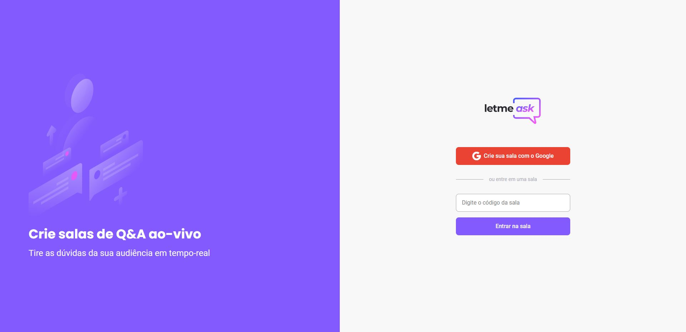

<p align="center">
    
</p>

<h2 align="center">Sobre 📖</h2>

<p>
O Letmeask é uma pequena aplicação voltada para criadores de conteudo, que permite a criação de salas de Q&A com o seu público. Esta aplicação foi desenvolvida durante a  **[Next Level Week Together](https://nextlevelweek.com/)**, 2021.
</p>

<p align="center">
  
</p>

<h2 align="center">Tecnologias Utilizada 🧪</h2>
<p>
Esse projeto foi desenvolvido com as seguintes tecnologias:

- [React](https://reactjs.org)
- [Firebase](https://firebase.google.com/)
- [TypeScript](https://www.typescriptlang.org/)
</p>

<h2 align="center">Como Usar 🤔</h2>

   ```
   - Clone esse repositório:
   $ git clone https://github.com/kaironferreira/letmeask.git

   - Entre no diretório:
   $ cd letmeask-master

   - Instale as dependências:
   $ yarn

   - Inicie o app: 
   $ yarn start

   ```

<p>
O app estará disponível no seu browser pelo endereço http://localhost:3000.

Lembrando que será necessário criar uma conta no [Firebase](https://firebase.google.com/) e um projeto para disponibilizar um Realtime Database.

</p>
